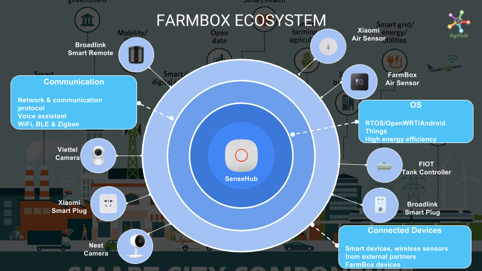
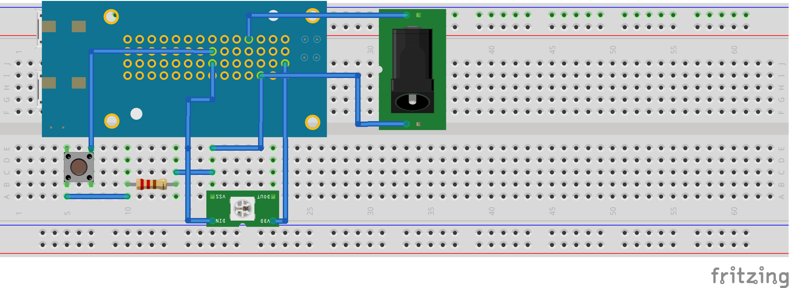

# Sense Hub Android Things

Sense Hub Gateway is an important bridge between farm and end user. It's a wireless device to help collect data from the wireless sensors, which are installed on the farm such as light, air temperature, air humidity, soil humidity, soil nutrient, water pH, water EC ... The data is sent to our server by WiFi connection. On the server, the data is aggregated and also combined with the plant profile data to make decision turn on, turn off or control the devices on the farm such as lamp, water pump, misting pump, fan and air conditioner by automatically. The output from aggregation is sent to Sense Hub Gateway by MQTT to control the local devices on the farm.

## Features

- Web server dashboard configuration
- Get data from bluetooth low energy (BLE) sensor
- Control WiFi device: smart plug, smart remote, smart hydroponic controller, smart humidify...
- MQTT


## Supported Devices


### BLE devices

- [MiFlora sensor](https://www.aliexpress.com/item/Original-English-Version-Mi-Flora-Monitor-Xiaomi-Flower-Care-Monitor-Soil-Water-Test-Machine-For-Garden/32804998987.html)
- [Axaet air sensor](https://www.alibaba.com/product-detail/AXAET-Wireless-Proximity-ibeacon-BLE-temperature_60668543075.html)
- [TI SensorTag](http://www.ti.com/ww/en/wireless_connectivity/sensortag/)
- [nRF51822 Sensor Module](https://www.aliexpress.com/item/nRF51822-Bluetooth-4-0-BLE-SOC-Temperature-Atmospheric-Pressure-Acceleration-Sensor-Module-Gyroscope-Light-Sensor-MPU6050/32816579479.html)
- ...
### WiFi device

- [Broadlink SP mini 3](https://www.aliexpress.com/item/Broadlink-SP-Mini-Smart-Wireless-Remote-Control-Socket-Power-Supply-Plug-Wifi-Plug-timer-extender-time/32223307784.html)
- [Broadlink RM mini 3](https://www.aliexpress.com/item/Broadlink-RM2-RM-PRO-Smart-Home-Automation-WiFi-IR-RF-Universal-Intelligent-Wireless-remote-Controller-for/32729931353.html)
- FIOT smart hydroponic controller

- ...
## Pre-requisites

- Android Things compatible board
- Android Studio 2.2+
- 1 [WS2812B compatible RGB Led strip](https://www.adafruit.com/product/1612)
- 1 [Push-button](https://www.adafruit.com/product/1400)

## Schematics



## Build and install

On Android Studio, click on the "Run" button.
If you prefer to run on the command line, type
```bash
./gradlew installDebug
adb shell am start com.example.androidthings.weatherstation/.WeatherStationActivity
```

If you have everything set up correctly:
- The segment display will show the current temperature.
- If the button is pressed, the display will show the current pressure.
- If a Piezo Buzzer is connected, it will plays a funny sound on startup.
- If a APA102 RGB Led strip is connected, it will display a rainbow of 7 pixels indicating the current pressure.
- If a Google Cloud Platform project is configured (see instruction below), it will publish the sensor data to Google Cloug PubSub.

## Google Cloud Platform configuration (optional)

0. Go to your project in the [Google Cloud Platform console](https://console.cloud.google.com/)
0. Under *API Manager*, enable the following APIs: Cloud Pub/Sub
0. Under *IAM & Admin*, create a new Service Account, provision a new private key and save the generated json credentials.
0. Under *Pub/Sub*: create a new topic and in the *Permissions* add the service account created in the previous step with the role *Pub/Sub Publisher*.
0. Under *Pub/Sub*: create a new *Pull subscription* on your new topic.
0. Import the project into Android Studio. Add a file named `credentials.json` inside `app/src/main/res/raw/` with the contents of the credentials you downloaded in the previous steps.
0. In `app/build.gradle`, replace the `buildConfigField` values with values from your project setup.

After running the sample, you can check that your data is ingested in Google Cloud Pub/Sub by running the following command:
```
gcloud --project <CLOUD_PROJECT_ID> beta pubsub subscriptions pull <PULL_SUBSCRIBTION_NAME>
```

Note: If there is no `credentials.json` file in `app/src/main/res/raw`, the app will
 run offline and will not send sensor data to the [Google Cloud Pub/Sub](https://cloud.google.com/pubsub/).

## Next steps

Now your weather sensor data is continuously being published to [Google Cloud Pub/Sub](https://cloud.google.com/pubsub/):
- process weather data with [Google Cloud Dataflow](https://cloud.google.com/dataflow/) or [Google Cloud Functions](https://cloud.google.com/functions/)
- persist weather data in [Google Cloud Bigtable](https://cloud.google.com/bigtable/) or [BigQuery](https://cloud.google.com/bigquery/)
- create some weather visualization with [Google Cloud Datalab](https://cloud.google.com/datalab/)
- build weather prediction model with [Google Cloud Machine Learning](https://cloud.google.com/ml/)

## License

[GNU General Public License v3.0](https://github.com/dmtan90/Sense-Hub-Android-Things/blob/master/LICENSE)

If you have any question or want to cooperate, please contact us by email dmtan90@gmail.com.
